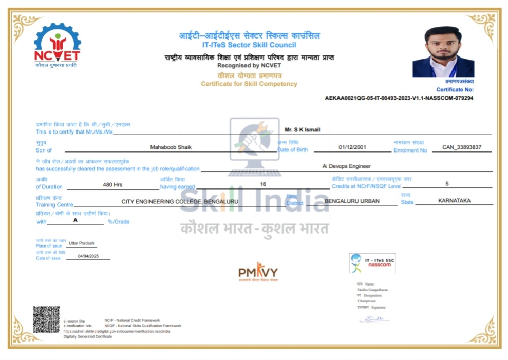
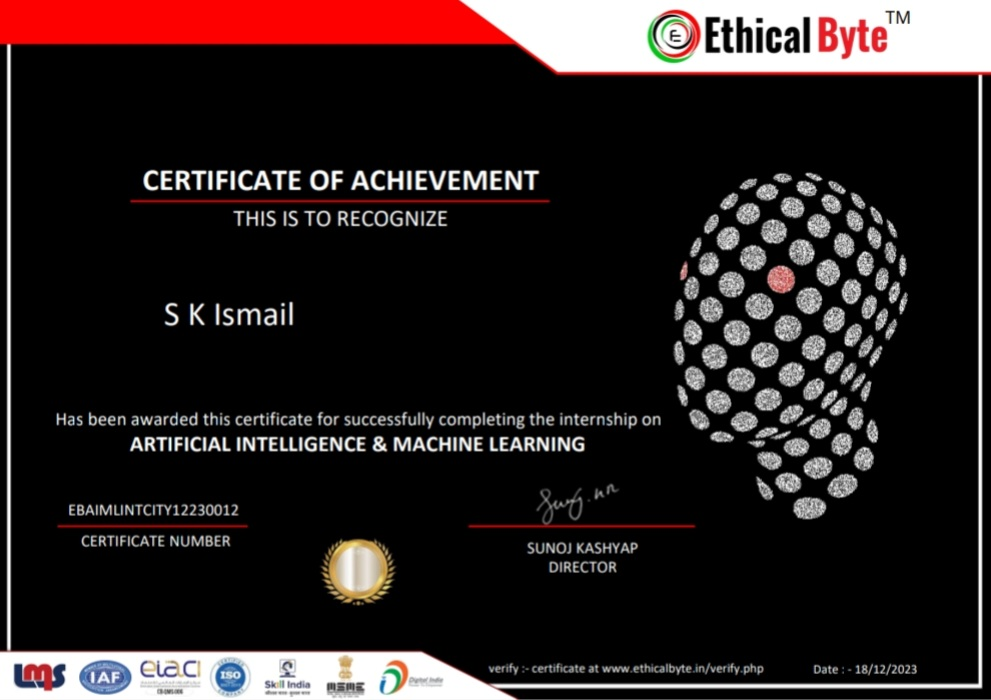
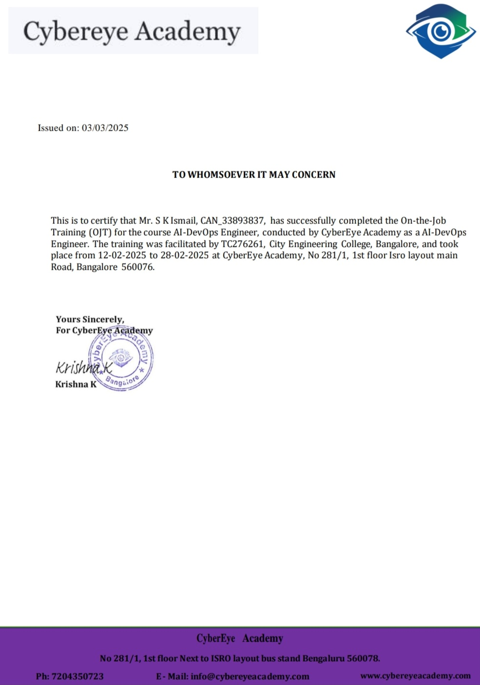

<p align="center">
  <a href="https://github.com/Skismail57">
    
  </a>
</p>

<p align="center">
  
  
</p>

<p align="center">
  <a href="https://github.com/Skismail57">
    
  </a>
  <a href="https://www.linkedin.com/in/s-k-ismail-b5ba942b7">
    
  </a>
  <a href="mailto:shaikhmismail66@gmail.com">
    
  </a>
  <a href="https://github.com/Skismail57">
    
  </a>
</p>

<p align="center">
  
  
  
</p>

---

## 👨‍💻 About Me

I'm a passionate **Software Engineer** and **Backend Developer** specializing in **Artificial Intelligence and Machine Learning** with a strong focus on building robust backend systems and scalable cloud-native applications.

- 🚀 **Backend Development**: Building high-performance, scalable systems
- 🤖 **AI/ML**: Developing intelligent solutions and MLOps pipelines
- 💡 **Product Mindset**: Delivering impactful, user-centric solutions

### Open To
- Software Engineering Roles
- Backend Developer Positions
- AI/ML Engineer Positions
- Open Source Collaborations

---

## 🛠️ Tech Stack

### Languages
<p align="left">
  
  
  
  
  
  
</p>

### Frontend
<p align="left">
  
  
  
  
</p>

### Backend & Databases
<p align="left">
  
  
  
  
  
  
</p>

### Cloud, DevOps & Tooling
<p align="left">
  
  
  
  
  
  
  
  
</p>

---

## 🚀 Featured Projects

<details>
<summary><h3><a href="https://github.com/Skismail57/NEXTCART_Full-_Stack_AI-Powered_E-Commerce_Platform">NEXTCART_Full-_Stack_AI-Powered_E-Commerce_Platform</a></h3></summary>

A complete, production-ready full-stack e-commerce platform built with Next.js 14 (frontend), Core Java 17 (monolith backend), and Spring Boot Microservices (scalable backend). Features AI-powered recommendations, NEXA AI chatbot, voice assistant, fraud detection, price history analysis, and more!
</details>

<details>
<summary><h3><a href="https://github.com/Skismail57/AI-Powered-Student-Management-System">AI-Powered-Student-Management-System</a></h3></summary>

A full-stack AI-powered student management platform with role-based portals for admin, faculty, students, and parents, featuring attendance, analytics, GPA tracking, curriculum management, reports, notifications, and academic support tools.
</details>

<details>
<summary><h3><a href="https://github.com/Skismail57/Health-Stack-System">Health-Stack-System</a></h3></summary>

Comprehensive Django-based hospital and clinic management platform. Manages patients, appointments, admissions, EHR, prescriptions/PDFs, pharmacy and billing. Includes role-based dashboards, real-time chat, Celery tasks, DRF APIs documented with drf‑spectacular, and SSLCommerz payments.
</details>

<details>
<summary><h3><a href="https://github.com/Skismail57/Django-To-Do-List_with_User_Authentication">Django-To-Do-List_with_User_Authentication</a></h3></summary>

A secure Django-based To-Do List application with user authentication, task management, and responsive design. Features include user registration, login/logout, CRUD operations for tasks, and custom error pages. Built with Django 5.0, HTML5, CSS3, and SQLite/PostgreSQL support. Ready for deployment with Docker.
</details>

<details>
<summary><h3><a href="https://github.com/Skismail57/UPI_Fraud_Detection_Using_Machine_Learning">UPI_Fraud_Detection_Using_Machine_Learning</a></h3></summary>

Advanced UPI Fraud Detection System using machine learning and deep learning techniques. Features real-time transaction monitoring, multi-model ensemble detection, and interactive dashboard Visualization.
</details>

<details>
<summary><h3><a href="https://github.com/Skismail57/BLOCKELECT-BlockchainVoting-System">BLOCKELECT-BlockchainVoting-System</a></h3></summary>

A web3 voting system that ensures secure voter authentication, immutability of votes, and transparent, real-time election results using cryptographic methods and smart contracts on the Ethereum blockchain.
</details>

---

## 💼 Experience

### Software Engineer Intern
**Tech Company** | Jan 2024 - Present

- Designed and implemented CI/CD pipelines using Jenkins
- Provisioned and managed cloud infrastructure on AWS using Terraform
- Containerized applications using Docker and orchestrated with Kubernetes
- Automated configuration management with Ansible
- Collaborated with cross-functional teams to deliver production-ready features

<p align="left">
  
  
  
  
  
</p>

---

## 🏆 Achievements

| Recognition | Details |
|-------------|---------|
| **Top Contributor** | Active open source contributor with multiple contributions |
| **Project Completion** | Successfully delivered end-to-end DevOps project |
| **Academic Excellence** | Consistent high performance in AI/ML coursework |

---

## 📜 Certifications

<p align="center">
  <a href="assets/assets/certificates/Certificate%20of%20Completion%20Advance%20Java%20Programing%20Certificate.jpg"></a>
  <a href="assets/assets/certificates/AI-DevOps-Engineer-Internship-Certificate.jpg"></a>
  <a href="assets/assets/certificates/AIML-internship-Ethical-Byte.jpg"></a>
  <a href="assets/assets/certificates/Certificate%20of%20Completion%20Of%20Python%20Data%20Structures.jpg"></a>
  <a href="assets/assets/certificates/Certificate%20of%20Completion%20of%20Applications%20of%20AI.jpg"></a>
  <a href="assets/assets/certificates/Certificate%20of%20Completion%20of%20Machine%20Learning.jpg"></a>
  <a href="assets/assets/certificates/Certificate%20of%20Completion%20of%20Software%20Testing.jpg"></a>
  <a href="assets/assets/certificates/Cloud-Native%20Application%20Development%20with%20IBM%20cloud%20and%20Kubernetes%20Certificate.jpg"></a>
  <a href="assets/assets/certificates/Marksheet%20of%20AI-DevOps-Engineer%20Internship%20Certificate.jpg"></a>
  <a href="assets/assets/certificates/On-Job-Training-Certificate.jpg"></a>
  <a href="assets/assets/certificates/Rooman%20Technologies%20Certificate%20of%20Completion%20of%20Life%20Skills.jpg"></a>
</p>

---

## 💻 Coding Profiles

<p align="center">
  <a href="https://leetcode.com/Skismail57">
    
  </a>
  <a href="https://auth.geeksforgeeks.org/user/Skismail57">
    
  </a>
  <a href="https://www.hackerrank.com/Skismail57">
    
  </a>
  <a href="https://www.codechef.com/users/Skismail57">
    
  </a>
</p>

---

## 📊 GitHub Analytics

<p align="center">
  
</p>

<p align="center">
  
</p>

<p align="center">
  
</p>

---

## 🏅 GitHub Trophies

<p align="center">
  
</p>

---

## 📈 Contribution Activity

<p align="center">
  
</p>

---

## 🐍 Contribution Snake

<p align="center">
  
</p>

---

## 🎯 Current Focus

```yaml
Learning:
  - Advanced MLOps
  - Cloud Native Architectures
  - Generative AI
  
Building:
  - ML Pipeline Automation
  - Scalable Web Applications
  - Open Source Tools

Exploring:
  - Kubernetes Ecosystem
  - Serverless Computing
  - LLM Applications

Open To:
  - Full-time Roles
  - Freelance Projects
  - Open Source Collaborations
```

---

## 📫 Connect With Me

<p align="center">
  <a href="mailto:shaikhmismail66@gmail.com">
    
  </a>
  <a href="https://www.linkedin.com/in/s-k-ismail-b5ba942b7">
    
  </a>
  <a href="https://github.com/Skismail57">
    
  </a>
  <a href="https://github.com/Skismail57">
    
  </a>
</p>

---

<p align="center">
  <i>"Code is like humor. When you have to explain it, it’s bad."</i>
</p>

<p align="center">
  
</p>
